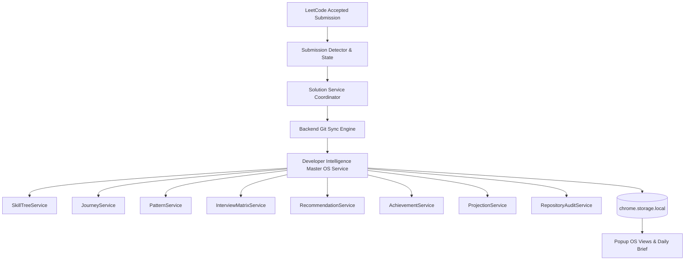
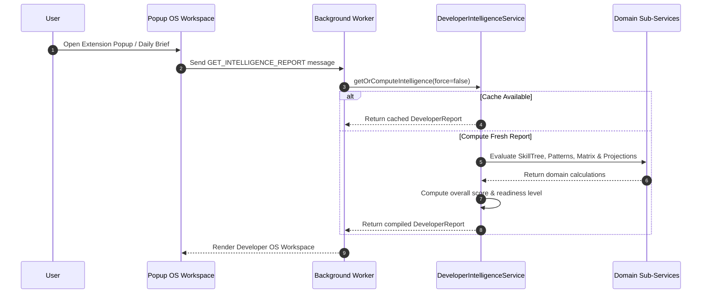

# Developer Intelligence OS Architecture & Data-Flow Diagrams

This document illustrates the sequence and data-flow diagrams for the **Developer Intelligence OS** pipeline in LeetCode Auto Sync.

## 1. Domain Architecture Overview

## 2. Intelligence Processing & UI Sequence Diagram

## 3. Streak Architecture & Data Isolation

The extension maintains three independent streak concepts in `DeveloperDataStore.stats`:

### Official Streak
- **Source**: `streakCounter.streakCount` (LeetCode GraphQL top-level endpoint)
- **Features**: Includes Time Travel Tickets, skipped-day recovery (`daysSkipped`), and current day completion status (`currentDayCompleted`).
- **UI Display**: Authoritative streak rendered in Popup UI & Developer View Model (`🔥 {officialStreak} Days`).

### Calendar Streak
- **Source**: `userCalendar.streak` (LeetCode GraphQL matchedUser endpoint)
- **Features**: Raw consecutive submission count directly from user calendar response.
- **Usage**: Analytical tracking and data parity verification.

### Reconstructed Streak
- **Source**: Computed locally from `userCalendar.submissionCalendar` active daily timestamps.
- **Features**: Deterministic consecutive day calculation starting from today/yesterday.
- **Usage**: Internal validation, debugging, and offline fallback.

