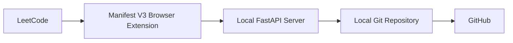

# LeetCode Auto Sync

LeetCode Auto Sync is a local-first backend foundation for a future browser-extension-driven workflow that will capture LeetCode activity and synchronize it into a Git-backed repository. This PR establishes only the server base so later milestones can layer in parsing, Git automation, and repository synchronization without exposing credentials to the browser extension.

## Architecture



## Current Features

- FastAPI application skeleton
- Structured JSON logging
- Root endpoint for service metadata
- Health endpoint for readiness checks
- Centralized configuration values
- JSON exception handling for API errors

## Installation

Create a virtual environment and install the server dependencies:

```bash
python -m venv .venv
.venv\Scripts\activate
pip install -r server/requirements.txt
```

## Running the Server

Start the API from the `server` directory:

```bash
cd server
uvicorn app:app --reload
```

You can also override configuration with environment variables such as `HOST`, `PORT`, `LOG_LEVEL`, and `LEETCODE_REPO_PATH`.

## Example Health Response

```json
{
  "status": "ok",
  "version": "0.1.0"
}
```

## Roadmap

- Add the `/submit` workflow in a later PR
- Implement LeetCode parsing and problem extraction
- Add Git automation for local repository sync
- Generate problem README files and folder structure
- Add browser extension integration
- Expand configuration and operational logging

## API

### POST /submit

Accepts a JSON payload describing an accepted LeetCode submission. The server
validates the request and returns a stable acknowledgement on success.

Example request:

```json
{
  "id": 49,
  "title": "Group Anagrams",
  "slug": "group-anagrams",
  "difficulty": "Medium",
  "language": "cpp",
  "code": "#include <bits/stdc++.h>..."
}
```

Example success response:

```json
{
  "status": "accepted",
  "message": "Submission received successfully.",
  "problem": {
    "id": 49,
    "title": "Group Anagrams"
  }
}
```

Example validation error (missing or invalid fields):

```json
{
  "detail": [
    {
      "loc": ["body", "id"],
      "msg": "ensure this value is greater than 0",
      "type": "value_error.number.not_gt"
    }
  ]
}
```

## Repository Writer

This service will generate a local repository layout for validated submissions.

Layout produced under the configured `LEETCODE_REPO_PATH` (default is the
project root) in a `Leetcode-solutions/` directory. Example structure:

```
Leetcode-solutions/
  Easy/
    0001-Two-Sum/
      README.md
      solution.cpp
  Medium/
  Hard/
```

Supported language -> filename mapping:

- `cpp` -> `solution.cpp`
- `python3`, `python` -> `solution.py`
- `java` -> `Solution.java`
- `javascript` -> `solution.js`
- `typescript` -> `solution.ts`
- `go` -> `solution.go`
- `rust` -> `solution.rs`
- `c` -> `solution.c`
- `csharp` -> `Solution.cs`
- `kotlin` -> `Solution.kt`
- `swift` -> `Solution.swift`

Configure the target repository root by setting the `LEETCODE_REPO_PATH`
environment variable or updating `server/config.py`.
