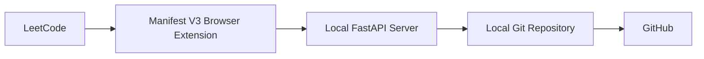

# LeetCode Auto Sync

LeetCode Auto Sync is a local-first backend foundation for a future browser-extension-driven workflow that will capture LeetCode activity and synchronize it into a Git-backed repository. This PR establishes only the server base so later milestones can layer in parsing, Git automation, and repository synchronization without exposing credentials to the browser extension.

## Architecture



## Current Features

- FastAPI application skeleton
- Structured JSON logging
- Root endpoint for service metadata
- Health endpoint for readiness checks
- Centralized configuration values
- JSON exception handling for API errors

## Installation

Create a virtual environment and install the server dependencies:

```bash
python -m venv .venv
.venv\Scripts\activate
pip install -r server/requirements.txt
```

## Running the Server

Start the API from the `server` directory:

```bash
cd server
uvicorn app:app --reload
```

You can also override configuration with environment variables such as `HOST`,
`PORT`, `LOG_LEVEL`, `LEETCODE_REPO_PATH`, `AUTO_PUSH`, `REMOTE_NAME`, and
`DEFAULT_BRANCH`.

## Example Health Response

```json
{
  "status": "ok",
  "version": "0.1.0"
}
```

## Roadmap

- Add the `/submit` workflow in a later PR
- Implement LeetCode parsing and problem extraction
- Add Git automation for local repository sync
- Generate problem README files and folder structure
- Add browser extension integration
- Expand configuration and operational logging

## API

### POST /submit

Accepts a JSON payload describing an accepted LeetCode submission. The server
validates the request and returns a stable acknowledgement on success.

Example request:

```json
{
  "id": 49,
  "title": "Group Anagrams",
  "slug": "group-anagrams",
  "difficulty": "Medium",
  "language": "cpp",
  "code": "#include <bits/stdc++.h>..."
}
```

Example success response:

```json
{
  "status": "created",
  "problem": {
    "id": 49,
    "title": "Group Anagrams"
  },
  "git": {
    "status": "committed",
    "commit": "abc1234",
    "branch": "main",
    "pushed": true,
    "files": [
      "Leetcode-solutions/Medium/0049-Group-Anagrams/README.md",
      "Leetcode-solutions/Medium/0049-Group-Anagrams/solution.cpp",
      "README.md"
    ]
  }
}
```

Example validation error (missing or invalid fields):

```json
{
  "detail": [
    {
      "loc": ["body", "id"],
      "msg": "ensure this value is greater than 0",
      "type": "value_error.number.not_gt"
    }
  ]
}
```

## Repository Writer

This service will generate a local repository layout for validated submissions.

Layout produced under the configured `LEETCODE_REPO_PATH` (default is the
project root) in a `Leetcode-solutions/` directory. Example structure:

```
Leetcode-solutions/
  Easy/
    0001-Two-Sum/
      README.md
      solution.cpp
  Medium/
  Hard/
```

Supported language -> filename mapping:

- `cpp` -> `solution.cpp`
- `python3`, `python` -> `solution.py`
- `java` -> `Solution.java`
- `javascript` -> `solution.js`
- `typescript` -> `solution.ts`
- `go` -> `solution.go`
- `rust` -> `solution.rs`
- `c` -> `solution.c`
- `csharp` -> `Solution.cs`
- `kotlin` -> `Solution.kt`
- `swift` -> `Solution.swift`

Configure the target repository root by setting the `LEETCODE_REPO_PATH`
environment variable or updating `server/config.py`.

## Root README generation

The server can automatically generate the repository's root `README.md` by
scanning the `Leetcode-solutions/` tree. The generator produces a deterministic
index and statistics summary (total solved, counts by difficulty, and a table
of problems) and overwrites the repository README on each run. The generator
is invoked automatically after a successful repository write (for example
when a new problem is added via the `POST /submit` flow).

Root README generation includes:

- Repository scanning from `Easy/`, `Medium/`, and `Hard/`
- Statistics for total solved and solved counts by difficulty
- A problem index sorted by problem number
- Deterministic regeneration from the filesystem source of truth

See `server/repository_scanner.py` and `server/root_readme.py` for implementation
details and configuration options.

## Git Automation

After the repository writer saves a submission and the root README is
regenerated, the backend runs the Git service:

```text
Repository Writer
        |
        v
Root README Generator
        |
        v
Git Service
        |
        v
Return Success
```

The Git service uses the installed local `git` executable through Python
`subprocess`. It validates the repository, checks the current branch, detects
modified or untracked files, stages changes with `git add .`, creates a
problem-specific commit, and optionally pushes the commit to the configured
remote.

Commit messages are generated from the submission result:

- New problem: `Add 0049 - Group Anagrams`
- Updated problem: `Update 0049 - Group Anagrams`

If there are no repository changes, the service skips commit and push:

```json
{
  "status": "no_changes"
}
```

### Requirements

Install Git and make sure the `git` executable is available on `PATH`.

The target repository configured by `LEETCODE_REPO_PATH` must already be a Git
repository. Configure credentials, SSH keys, or credential helpers outside this
application; the backend does not manage GitHub authentication.

### Configuration

| Variable | Default | Description |
|----------|---------|-------------|
| `AUTO_PUSH` | `true` | When enabled, push successful commits to the configured remote. |
| `REMOTE_NAME` | `origin` | Remote name used for pushes. |
| `DEFAULT_BRANCH` | `main` | Expected default branch for logging and operational context. |
| `LEETCODE_REPO_PATH` | project root | Local repository root to update and commit. |

When `AUTO_PUSH=false`, the service still stages and commits changes but skips
`git push`. The API response includes `"pushed": false`.

### Troubleshooting

Git failures are returned as structured JSON without raw stack traces. Common
error codes include:

- `git_not_installed`: Git is missing from `PATH`.
- `invalid_repository`: `LEETCODE_REPO_PATH` is not a Git repository.
- `detached_head`: the repository is not currently on a branch.
- `merge_conflicts`: unresolved merge conflicts are present.
- `missing_remote`: the configured remote does not exist.
- `commit_failure`: Git could not create the commit.
- `push_failure`: Git could not push to the configured remote.

Example error response embedded in the submission acknowledgement:

```json
{
  "status": "created",
  "problem": {
    "id": 49,
    "title": "Group Anagrams"
  },
  "git": {
    "status": "error",
    "error": {
      "code": "missing_remote",
      "message": "Git remote 'origin' is not configured."
    }
  }
}
```
