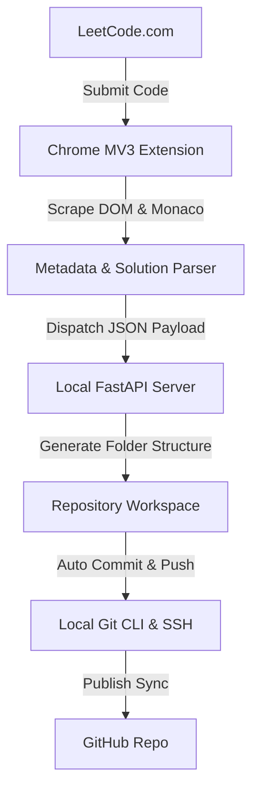

# LeetCode Auto Sync

LeetCode Auto Sync is a local-first, production-grade tool that automatically captures your accepted LeetCode submissions, extracts their metadata and solution source code, and commits them to your local Git repository.

## Architecture

The extension is designed around a decoupled, local-first security model:



## Features

- **Decoupled Architecture**: All extension operations, DOM parsing, and Monaco Editor scraping happen locally.
- **State-of-the-Art Parsing**: Employs a hybrid Monaco model-retrieval pipeline that bypasses UI virtualization, capturing indentations and formatting exactly.
- **Automatic Folder Mappings**: Group solutions under organized directories by difficulty (e.g. `Easy/`, `Medium/`, `Hard/`).
- **Git Automation**: Writes code files, auto-creates README problem definitions, performs Git commits with clean conventional messages, and optionally pushes to your remote tracking branch.
- **Diagnostics Dashboard**: View connection state, active page type, submission machine states, and sync logs with clipboard copying tools.
- **Configuration Storage**: Customize server URLs, persisted safely in `chrome.storage.local`.

---

## Installation & Setup

### 1. Backend Server Setup

**Prerequisites**: Python 3.10+ and Git CLI must be installed on your machine.

1. Clone the repository to your local machine:
   ```bash
   git clone https://github.com/Rakshaad-Kolhe/leetcode-auto-sync.git
   cd leetcode-auto-sync
   ```
2. Create and activate a Python virtual environment:
   ```bash
   python -m venv .venv
   # Windows:
   .venv\Scripts\activate
   # macOS/Linux:
   source .venv/bin/activate
   ```
3. Install dependencies:
   ```bash
   pip install -r server/requirements.txt
   ```
4. Start the FastAPI local server:
   ```bash
   cd server
   uvicorn app:app --reload --port 8000
   ```
   *The server is now listening at `http://127.0.0.1:8000`.*

#### Backend Environment Variables
You can configure the server behaviour by setting environment variables in a local `.env` file inside `server/` or in your system terminal:
- `HOST` (Default: `127.0.0.1`)
- `PORT` (Default: `8000`)
- `LEETCODE_REPO_PATH`: The target folder where you want your synced problems to write to. (Default: repository root directory)
- `AUTO_PUSH`: Set to `true` to run `git push` automatically after commits. (Default: `true`)
- `REMOTE_NAME`: Target remote registry name. (Default: `origin`)
- `DEFAULT_BRANCH`: Active tracking branch. (Default: `main`)

---

### 2. Extension Setup

1. Open your Google Chrome or Chromium browser.
2. Navigate to the extensions page by entering `chrome://extensions/` in the URL bar.
3. Turn on the **Developer mode** toggle in the top-right corner.
4. Click the **Load unpacked** button in the top-left corner.
5. Select the `extension/` directory from the root of this project.
6. The LeetCode Auto Sync card should now appear in your list. Pin the extension to your browser toolbar.

---

## Usage Walkthrough

1. Click on the extension icon in your toolbar to open the dashboard popup.
2. Confirm the connection status displays **Connected** (in green). If you are running the backend on a custom port, change the **Backend URL** in the settings section, click **Save Settings**, and verify that the connection changes to green.
3. Go to LeetCode and navigate to any problem (e.g. [Two Sum](https://leetcode.com/problems/two-sum/)).
4. Notice that the popup context updates to **Page Type: PROBLEM** and shows the active slug.
5. Write your solution in Monaco Editor and click the **Submit** button.
6. The popup badge will change to **State: SUBMITTING** and pulse **Judging...** in blue.
7. If your code yields an **Accepted** verdict:
   - The extension extracts the problem details (Title, ID, Slug, Difficulty, and Language).
   - The extension scrapes the Monaco Editor code value directly from the memory model.
   - The popup displays the completed metadata panel.
   - The background script dispatches the payload to the local server.
   - The local server generates difficulty directories, writes your solution file, creates a `README.md` problem template, and commits it to your local Git history.
   - The popup synchronization card displays **Latest Sync: Success** along with a timestamp.

---

## Security Model

Your credentials stay yours:
1. **Zero Remote Dependencies**: The extension only makes HTTP requests to your locally configured server (`127.0.0.1:8000`). No analytics, tracking, or telemetry servers are contacted.
2. **Safe Credentials Handling**: The extension *never* holds, prompts, or requests your GitHub personal access tokens or private keys. The backend uses the native, local Git CLI installed on your operating system, meaning Git naturally uses the secure keys and auth helpers setup inside your machine's keychain.
3. **Restricted Domain Permissions**: The extension only has permissions to run on `https://leetcode.com/*` and does not run on other tabs or websites.

---

## Diagnostics & Troubleshooting

If you encounter issues, click the **Check Backend** button in the popup to refresh logs. You can also click **Copy Diagnostics Report** to write system information directly to your clipboard for GitHub issue submissions.

### Common Problems & Resolutions

#### 1. Backend connection shows Disconnected
- Verify that your FastAPI python process is active and running in your terminal.
- Ensure that the URL configuration in your extension popup matches the exact port (e.g. `http://127.0.0.1:8000`).
- Check that your firewalls are not blocking localhost cross-origin requests.

#### 2. Manual Synchronization Retry
- If a submission succeeded while the backend server was offline, start your server, open the extension popup, and click **Retry Last Sync** to push the last cached solution.

---

## Frequently Asked Questions (FAQ)

### Does it support automatic retries?
No, the extension does not include automatic retries or offline databases to avoid cluttering local disk storage. If a sync fails, click the manual **Retry Last Sync** button.

### What languages are supported?
All major languages on LeetCode (Python, C++, Java, JS, TypeScript, Go, Rust, Ruby, Kotlin, Swift, Scala, Elixir, PHP, SQL) are normalized and mapped to their appropriate file extensions.

---

## Known Limitations
- The extension requires the LeetCode tab to remain open until the submission judging completes to grab the Monaco code lines successfully.
- Code extraction is geared for standard Monaco-based LeetCode pages. If LeetCode performs full frontend changes, fallbacks will scan DOM trees.
